# Ozone Architecture

This page maps the Ozone UI repository to the runtime system it operates. It
combines the browser-side Next.js app, the packaged Ozone service entrypoint,
external atproto services, and the two documented deployment modes.

For a high-resolution PNG render, open
[architecture.png](./architecture.png).

```mermaid
flowchart TB
  subgraph Actors["Users and network actors"]
    Moderator["Moderators and admins"]
    ServiceAccount["Labeler service account"]
    IntakeTools["External intake and automod tools"]
    LabelConsumers["Apps and services consuming labels"]
  end

  subgraph Browser["Browser: Ozone UI"]
    UI["Next.js App Router UI<br/>app/* pages and components/* domains"]
    Providers["Root providers<br/>React Query, config, auth, configuration,<br/>external labelers, command palette, shell"]
    Features["Feature domains<br/>reports, events, repositories, queues,<br/>workspace, actions, settings, SafeLink,<br/>verification, team, sets, communication templates,<br/>analytics, scheduled actions"]
    ConfigFlow["Client configuration flow<br/>resolve service DID, metadata, DID document,<br/>labeler record, server config"]
    Agents["Atproto client agents<br/>pdsAgent, labelerAgent, appviewAgent, globalAgent"]
    BrowserCache["Browser cache<br/>React Query plus selected localStorage migrations"]
  end

  subgraph NextRoutes["Next.js route handlers and assets"]
    OAuthMetadata["/oauth-client.json<br/>OAuth client metadata"]
    SnapshotProxy["/api/get-record-snapshot<br/>snapshot proxy"]
    StaticAssets["public/* and optimized images"]
  end

  subgraph OzoneNode["Ozone service process"]
    ServiceIndex["service/index.js<br/>Next handler plus @atproto/ozone OzoneService"]
    NextHandler["Next request handler<br/>serves UI routes after XRPC middleware"]
    OzoneXrpc["Ozone XRPC API<br/>/xrpc/tools.ozone.*<br/>/xrpc/com.atproto.label.subscribeLabels"]
    Metadata["/.well-known/ozone-metadata.json<br/>service DID, URL, public key"]
    Domains["Ozone API domains<br/>server config; moderation events/statuses;<br/>reports/activity/stats; queues and assignments;<br/>settings, policies, severity levels, label groups;<br/>communication templates; sets; SafeLink;<br/>team; signatures; verification; hosting history"]
  end

  subgraph Persistence["Persistence and background work"]
    Postgres["Postgres<br/>moderation state, reports, queues, settings,<br/>team data, templates, scheduled work"]
    Daemon["service/daemon.js<br/>@atproto/ozone OzoneDaemon"]
  end

  subgraph Atproto["External atproto and optional service dependencies"]
    PLC["PLC directory<br/>DID document resolution"]
    PDS["PDS<br/>OAuth/credentials, repositories, records,<br/>labeler service record, email delivery,<br/>invite and admin functions"]
    AppView["AppView<br/>profiles, posts, feeds, lists, search"]
    Chat["Chat moderation service<br/>conversation and message context"]
    BlobDivert["Blob divert service<br/>media diversion when configured"]
    SnapshotAPI["Snapshot API<br/>historical record snapshots when configured"]
  end

  subgraph SelfHosted["Self-hosted production topology"]
    Caddy["Caddy<br/>TLS and reverse proxy"]
    OzoneContainer["ozone container<br/>node ./service"]
    DaemonContainer["ozone-daemon container<br/>node ./service/daemon.js"]
    HostPostgres["postgres container"]
    Watchtower["watchtower<br/>image updates"]
  end

  subgraph LocalDev["Local development Compose topology"]
    DevOzoneUI["ozone-ui container<br/>Next dev server on :3000"]
    DevAtproto["atproto-dev-env container<br/>introspection :2581, PLC :2582,<br/>PDS :2583, AppView :2584, Ozone :2587"]
    DevPostgres["dev Postgres"]
    DevRedis["dev Redis"]
  end

  Moderator --> UI
  ServiceAccount --> UI
  UI --> Providers
  Providers --> ConfigFlow
  Providers --> Features
  Features --> Agents
  Features --> BrowserCache
  Features --> StaticAssets

  ConfigFlow -- "DID document lookup" --> PLC
  ConfigFlow -- "GET service metadata" --> Metadata
  ConfigFlow -- "read/write app.bsky.labeler.service" --> PDS
  ConfigFlow -- "tools.ozone.server.getConfig" --> OzoneXrpc

  Agents -- "OAuth or credential session" --> PDS
  Agents -- "withProxy('atproto_labeler', service DID)" --> OzoneXrpc
  Agents -- "app.bsky.* reads and fallback content" --> AppView
  Agents -- "com.atproto.* repo/admin/moderation calls" --> PDS
  Agents -- "chat.bsky.moderation.* context" --> Chat
  Agents -- "handle resolution" --> AppView
  PDS -- "fetches OAuth client metadata" --> OAuthMetadata
  Features -- "snapshot lookups" --> SnapshotProxy
  SnapshotProxy --> SnapshotAPI

  IntakeTools -- "tools.ozone.* and report APIs" --> OzoneXrpc
  LabelConsumers -- "WebSocket label stream" --> OzoneXrpc

  ServiceIndex --> OzoneXrpc
  ServiceIndex --> NextHandler
  OzoneXrpc --> Metadata
  OzoneXrpc --> Domains
  Domains --> Postgres
  Domains -- "identity lookups" --> PLC
  Domains -- "repo, email, invites, admin operations" --> PDS
  Domains -- "content hydration and search" --> AppView
  Domains -- "conversation moderation" --> Chat
  Domains -- "blob diversion" --> BlobDivert
  Daemon --> Postgres
  Daemon -- "executes scheduled/background Ozone work" --> Domains
  Daemon -- "pushes effects to configured services" --> PDS
  Daemon -- "pushes effects to configured services" --> AppView
  Daemon -- "pushes effects to configured services" --> BlobDivert

  Caddy --> OzoneContainer
  OzoneContainer -. "runs" .-> ServiceIndex
  OzoneContainer --> HostPostgres
  DaemonContainer -. "runs" .-> Daemon
  DaemonContainer --> HostPostgres
  Watchtower -. "updates" .-> OzoneContainer
  Watchtower -. "updates" .-> DaemonContainer

  DevOzoneUI -. "serves browser UI" .-> UI
  DevOzoneUI -. "NEXT_PUBLIC_OZONE_PUBLIC_URL=http://localhost:2587" .-> DevAtproto
  DevAtproto -. "provides local Ozone backend" .-> OzoneXrpc
  DevAtproto --> DevPostgres
  DevAtproto --> DevRedis

  classDef actor fill:#f8fafc,stroke:#64748b,color:#0f172a
  classDef browser fill:#ecfeff,stroke:#0891b2,color:#164e63
  classDef server fill:#eef2ff,stroke:#4f46e5,color:#312e81
  classDef data fill:#fefce8,stroke:#ca8a04,color:#713f12
  classDef external fill:#f0fdf4,stroke:#16a34a,color:#14532d
  classDef deploy fill:#fff7ed,stroke:#ea580c,color:#7c2d12

  class Moderator,ServiceAccount,IntakeTools,LabelConsumers actor
  class UI,Providers,Features,ConfigFlow,Agents,BrowserCache browser
  class OAuthMetadata,SnapshotProxy,StaticAssets,ServiceIndex,NextHandler,OzoneXrpc,Metadata,Domains server
  class Postgres,Daemon data
  class PLC,PDS,AppView,Chat,BlobDivert,SnapshotAPI external
  class Caddy,OzoneContainer,DaemonContainer,HostPostgres,Watchtower,DevOzoneUI,DevAtproto,DevPostgres,DevRedis deploy
```

## Boundary Notes

- The browser is not a thin static shell. It resolves labeler configuration,
  manages OAuth or credential login, creates the proxied labeler agent, and
  calls Ozone XRPC endpoints directly through `@atproto/api`.
- In self-hosting, `service/index.js` runs the Ozone backend and the Next.js
  request handler in one Node process. Ozone XRPC middleware handles API
  traffic first, then falls through to the Next handler for UI routes.
- In local Compose development, this repository only serves the Ozone UI on
  port 3000. The sibling `atproto` dev environment supplies the local PLC, PDS,
  AppView, Ozone backend, Postgres, and Redis services.
- `tools.ozone.*` calls are the primary moderation control plane. The UI also
  uses `app.bsky.*`, `com.atproto.*`, and `chat.bsky.*` calls for content
  hydration, identity, repo/admin operations, labeler records, and chat context.
- Ozone stores private moderation state in its Postgres database. Labels are
  the main public exception and are distributed through the label stream.
- The daemon is optional in the hosting guide but required for background
  behavior such as scheduled actions and configured service side effects.

## Source Map

- Runtime entrypoints: `service/index.js`, `service/daemon.js`, `Dockerfile`.
- Deployment topology: `service/compose.yaml`, `compose.dev.yaml`,
  `docs/local-development.md`, `HOSTING.md`.
- Browser shell and agents: `app/layout.tsx`,
  `components/shell/ConfigContext.tsx`, `components/shell/AuthContext.tsx`,
  `components/shell/ConfigurationContext.tsx`, `lib/client-config.ts`,
  `lib/server-config.ts`, `lib/constants.ts`.
- Next route handlers: `app/oauth-client.json/route.ts`,
  `app/api/get-record-snapshot/route.ts`.
- API surface evidence: structural searches for `tools.ozone.*`,
  `app.bsky.*`, `com.atproto.*`, and `chat.bsky.*` across `app/`,
  `components/`, and `lib/`.
